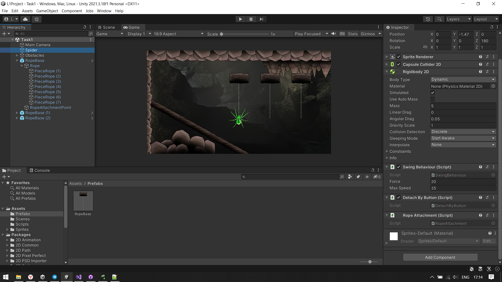
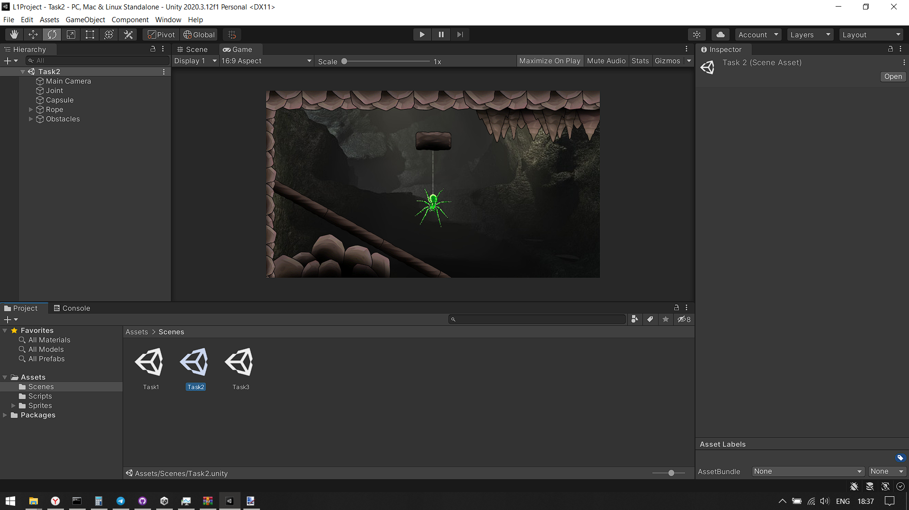
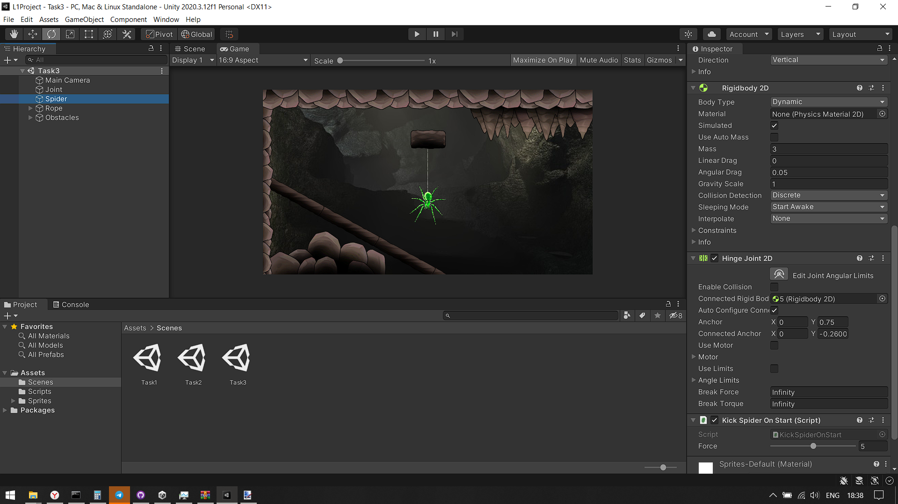

# YandexGameDev
Проекты Unity с интенсива Яндекс 2023

## Lesson 1
- Task 1
Собрал сцену

- Task 2
Заменил текстуры

- Task 3
Добавил физику веревки, в начале игры пауку придается небольшой импульс, паук раскачивается
